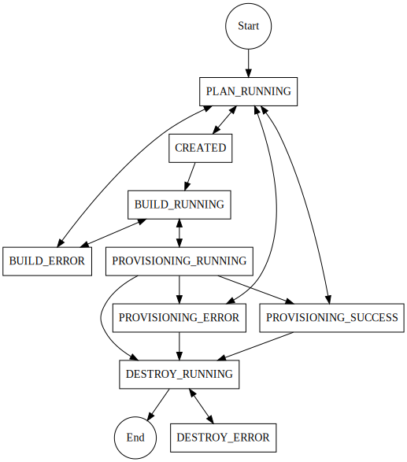

# Architecture

This diagram represents the architecture of MC Hub when used without authentication.

## Cluster statuses

The [ClusterStatusCode](../app/models/magic_castle/cluster_status_code.py) class is an enum which represents the current status of a Magic Castle cluster. The following diagram represents the possible transitions between statuses.

